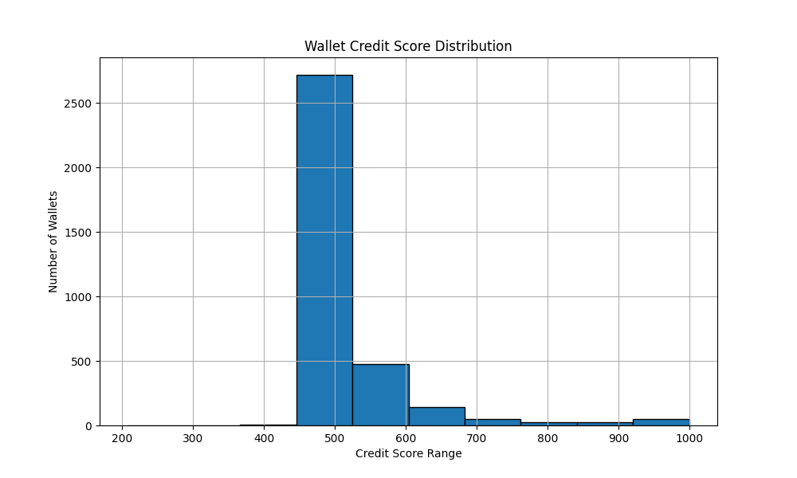

---

# analysis.md

```markdown
# Analysis

## Credit Score Distribution



### Observations

- **0–100:** Extremely high-risk wallets. These wallets have many liquidation calls and little repayment behavior.
- **100–300:** Medium-risk wallets. Likely borrowers with inconsistent repayments.
- **500–700:** Majority cluster. Shows regular deposit and repay activity.
- **700–1000:** Very reliable wallets. High deposit and repay counts, no liquidation events.

### Score Summary Table

| Score Range | Behavior Description               |
|-------------|------------------------------------|
| 0–100       | Bot-like or exploitative behavior  |
| 100–300     | Irregular repayment or risky usage |
| 500–700     | Normal user behavior               |
| 700–1000    | High reliability and activity      |

## Conclusion

The simple feature-weighted model successfully differentiates wallets based on responsible DeFi usage patterns. Future versions can refine features such as transaction timing or amounts for more nuanced scoring.

---

Credit Scoring System developed as per Zerufinance Internship Problem Statement 1.
